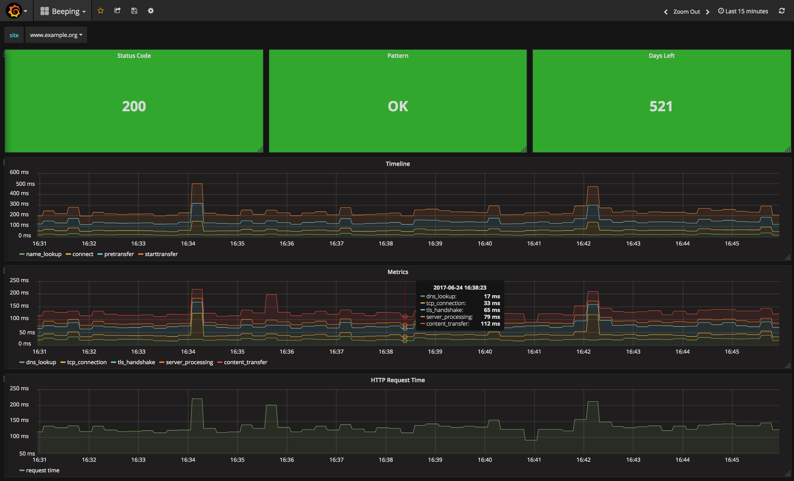

# website monitoring

When the ssl certificate is about to expire, when the database had gone away and your site is still responding 200 OK but without any real content or when it's taking too long to responde. All of that can be handled by setting up this stack.

# setup

```
# edit files/beeping.yml
make init
```

# usage

The monitoring stack includes:

* prometheus server
* grafana server (default creds: `admin/admin`)
* beeping service plus beeping prometheus exporter
* prometheus node exporter
 
# beeping

Monitoring is done via the [BeePing](https://github.com/yanc0/beeping) service.

Alerting can be setup on the grafana server or on prometheus/alertmanager.


# alerting

* HTTP status code.
* Pattern. An string which should be present on the html file.
* Certificate valid remaining days.
* HTTP request time. Total time the request took to complete, in milliseconds. 

## routing

Alerts are tagged on the rules file, using `LABELS`

```
ALERT HTTP_REQUEST_TIME
  IF beeping_http_request_time_seconds > 1000
  LABELS {severity="warning"}
  ANNOTATIONS {
      summary = "HTTP Request time  alert",
      description = "{{ $labels.site }} is taking too long to load",
  }
```

Instead of routing based on application name or dc, it can be done according to a predetermined level of impact in the service.

## example rules 

* when the certificate is less than 30 days before expiration day, send email
* when certificate is less than 3 days before expiration day, send pushover slack
* when http request time is over 1 min, send slack
* when pattern is not found, send pushover
* when status code is not 200, send pushover

# slack

For setting up alerts, an incoming webhook needs to be created on Slack.

#  testing alerts manually

```
curl -d '[{"labels": {"alertname": "warning alert", "severity": "warning","site":"example.org"}}]' http://localhost:9093/api/v1/alerts
curl -d '[{"labels": {"alertname": "critical alert", "severity": "critical","site":"example.com"}}]' http://localhost:9093/api/v1/alerts
```

# bonus point

 
Grafana dashboard included.



